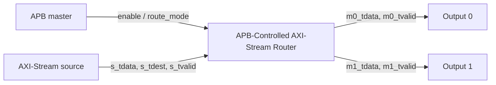

# APB-Controlled AXI-Stream Router Verification

A SystemVerilog verification project for a simplified APB-controlled AXI-Stream router.

## Overview

The DUT receives AXI-Stream packets from one input interface and routes them to one of two output interfaces.

APB is used as the control plane to configure the router. AXI-Stream is used as the data plane to transfer packets.



## DUT Features

* APB control register for `enable` and `route_mode`
* AXI-Stream input interface
* Two AXI-Stream output interfaces
* Default routing based on `s_tdest`
* Configurable force-route mode
* Backpressure propagation using the valid-ready handshake
* Packet counter
* Active-low asynchronous reset
* APB illegal-address error response

## Register Map

| Address | Register | Access | Description                                |
| ------- | -------- | ------ | ------------------------------------------ |
| `0x00`  | `CTRL`   | RW     | `bit[0]`: enable; `bit[2:1]`: route mode   |
| `0x04`  | `STATUS` | RO     | Current enable status                      |
| `0x08`  | `COUNT`  | RO     | Number of successfully transferred packets |

### Route Modes

| `route_mode` | Behavior                            |
| ------------ | ----------------------------------- |
| `2'b00`      | Route packet according to `s_tdest` |
| `2'b01`      | Force all packets to output 0       |
| `2'b10`      | Force all packets to output 1       |
| `2'b11`      | Reserved; uses `s_tdest` routing    |

## Verification Environment

The current environment uses directed SystemVerilog testbenches. Each testbench drives APB and AXI-Stream transactions, checks expected outputs, and produces a VCD waveform for debug.

```text
rtl/
└── apb_axis_router.sv

tb/
├── router_smoke_tb.sv
├── router_backpressure_tb.sv
├── router_mode_tb.sv
└── router_reset_during_traffic_tb.sv
```

## Directed Test Results

| Test                                | Scenario                                                                                                                   | Result |
| ----------------------------------- | -------------------------------------------------------------------------------------------------------------------------- | ------ |
| `router_smoke_tb.sv`                | Enables the router through APB and verifies default `s_tdest` routing to output 0 and output 1                             | PASS   |
| `router_backpressure_tb.sv`         | Blocks output 0 and verifies that `s_tready` deasserts, no packet is counted, and the packet transfers after ready returns | PASS   |
| `router_mode_tb.sv`                 | Verifies that APB `route_mode` overrides `s_tdest` and forces packets to output 0 or output 1                              | PASS   |
| `router_reset_during_traffic_tb.sv` | Asserts reset while a packet is pending under backpressure, then verifies reset recovery with a new packet                 | PASS   |

## Key Verification Findings

* A transfer occurs only when `tvalid && tready` is true.
* When an output is not ready, the router propagates backpressure by deasserting `s_tready`.
* A pending packet remains uncounted until the valid-ready handshake completes.
* Reset immediately clears router state and prevents a pending packet from transferring after reset.
* APB configuration controls the AXI-Stream data path through `enable` and `route_mode`.

## How to Run

1. Open [EDA Playground](https://www.edaplayground.com/).
2. Select **SystemVerilog** and **Icarus Verilog**.
3. Paste `rtl/apb_axis_router.sv` into the **Design** panel.
4. Paste one testbench from `tb/` into the **Testbench** panel.
5. Enable **Open EPWave after run**.
6. Click **Run**.

## Next Steps

* Add APB illegal-address verification for `pslverr`
* Add protocol assertions
* Add a scoreboard for end-to-end packet checking
* Add functional coverage and constrained-random testing
* Build a regression test list and closure report
