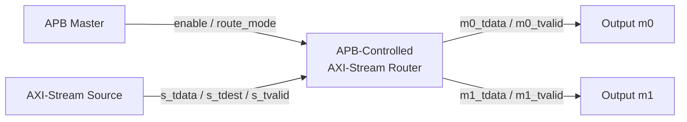
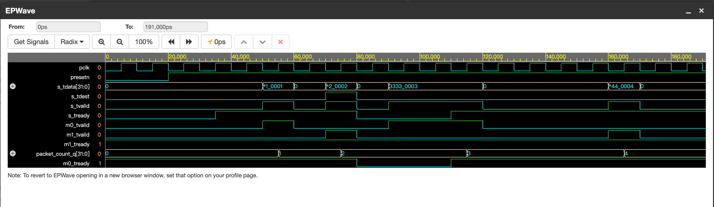
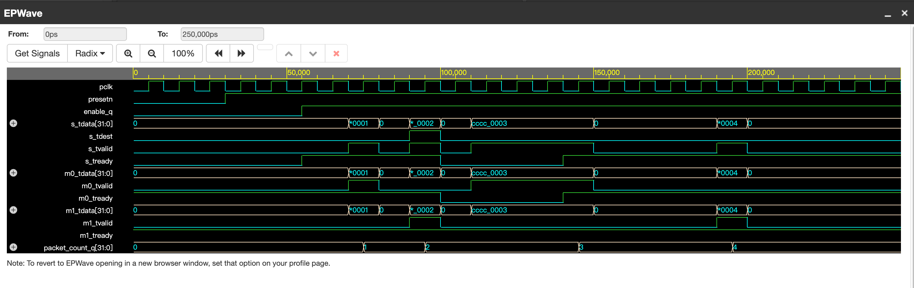

# APB-Controlled AXI-Stream Router Verification

A SystemVerilog verification project for a simplified APB-controlled AXI-Stream router.

## Overview

The DUT receives packets from one AXI-Stream input interface and routes each packet to output `m0` or `m1`.

* APB is the control plane: it configures `enable` and `route_mode`.
* AXI-Stream is the data plane: it transfers packets using the `valid-ready` handshake.
* The project includes directed tests, waveform evidence, a testplan, a reusable scoreboard, and an assertion-based protocol checker.



## DUT Features

* APB control register for `enable` and `route_mode`
* APB readback for CTRL, STATUS, and packet COUNT registers
* One AXI-Stream input interface
* Two AXI-Stream output interfaces
* Default routing based on `s_tdest`
* Force-route modes for output `m0` or `m1`
* Valid-ready backpressure propagation
* Packet counter
* Active-low asynchronous reset
* Illegal APB address error response through `pslverr`

## APB Register Map

| Address | Register | Description                                     |
| ------- | -------- | ----------------------------------------------- |
| `0x00`  | CTRL     | `enable` is bit 0; `route_mode` is bits `[2:1]` |
| `0x04`  | STATUS   | Readback of enable status                       |
| `0x08`  | COUNT    | Number of accepted AXI-Stream packets           |

## Route Mode Encoding

| `route_mode` | Behavior                                        |
| ------------ | ----------------------------------------------- |
| `2'b00`      | Route according to `s_tdest`                    |
| `2'b01`      | Force all packets to `m0`                       |
| `2'b10`      | Force all packets to `m1`                       |
| `2'b11`      | Reserved; DUT uses default routing by `s_tdest` |

## AXI-Stream Handshake

A packet is accepted by the router only when:

```text
s_tvalid && s_tready
```

A packet is consumed at an output only when:

```text
m*_tvalid && m*_tready
```

If the selected output is not ready, the router propagates backpressure by deasserting `s_tready`.

## Repository Structure

```text
.
├── rtl/
│   └── apb_axis_router.sv
├── tb/
│   ├── router_smoke_tb.sv
│   ├── router_backpressure_tb.sv
│   ├── router_mode_tb.sv
│   ├── router_reset_during_traffic_tb.sv
│   ├── router_disabled_tb.sv
│   ├── router_illegal_apb_tb.sv
│   ├── router_apb_readback_tb.sv
│   ├── router_scoreboard.sv
│   ├── router_scoreboard_tb.sv
│   ├── router_sva.sv
│   ├── router_assertion_checker.sv
│   └── router_sva_tb.sv
├── docs/
│   ├── testplan.md
│   └── images/
│       ├── smoke_test_waveform.png
│       ├── backpressure_test_waveform.png
│       ├── route_mode_test_waveform.png
│       ├── reset_during_traffic_waveform.png
│       ├── disabled_router_waveform.png
│       ├── illegal_apb_waveform.png
│       ├── apb_readback_waveform.png
│       ├── scoreboard_integration_waveform.png
│       └── assertion_checker_waveform.png
└── README.md
```

## Directed Test Results

| # | Testbench                           | Scenario                                                                                                        | Result |
| - | ----------------------------------- | --------------------------------------------------------------------------------------------------------------- | ------ |
| 1 | `router_smoke_tb.sv`                | Default routing using `s_tdest`; checks packet counter                                                          | PASS   |
| 2 | `router_backpressure_tb.sv`         | Selected output is not ready; checks `s_tready` backpressure                                                    | PASS   |
| 3 | `router_mode_tb.sv`                 | Checks force-`m0` and force-`m1` route modes                                                                    | PASS   |
| 4 | `router_reset_during_traffic_tb.sv` | Applies reset during traffic and verifies recovery                                                              | PASS   |
| 5 | `router_disabled_tb.sv`             | Router disabled; verifies no packet is accepted or forwarded                                                    | PASS   |
| 6 | `router_illegal_apb_tb.sv`          | Invalid APB address; checks `pslverr` response                                                                  | PASS   |
| 7 | `router_apb_readback_tb.sv`         | Reads CTRL, STATUS, and COUNT through APB                                                                       | PASS   |
| 8 | `router_scoreboard_tb.sv`           | Automated end-to-end data and destination checking with a reusable scoreboard                                   | PASS   |
| 9 | `router_sva_tb.sv`                  | Assertion-based protocol checking: disabled state, backpressure stability, and no simultaneous output transfers | PASS   |

## Scoreboard

`router_scoreboard.sv` is a reusable end-to-end checker connected to the DUT interfaces.

When an input packet is accepted, the scoreboard:

1. Captures the expected packet data.
2. Calculates the expected output from `route_mode` and `s_tdest`.
3. Stores data and expected destination in queues.
4. Waits for an output handshake.
5. Checks that the packet appears on the expected output with unchanged data.
6. Reports an error with `$fatal` if data or destination does not match.

This separates expected behavior from testbench stimulus and makes the verification environment more scalable.

## Assertion-Based Protocol Checker

`router_assertion_checker.sv` automatically checks key AXI-Stream protocol properties during simulation:

* A disabled router must not accept input traffic.
* `m0_tdata` and `m0_tvalid` must remain stable during m0 backpressure.
* `m1_tdata` and `m1_tvalid` must remain stable during m1 backpressure.
* The router must not complete transfers to m0 and m1 in the same cycle.

`router_sva.sv` contains the equivalent formal SystemVerilog Assertion (SVA) properties. Since Icarus Verilog does not support complete concurrent SVA syntax, `router_assertion_checker.sv` is used as an Icarus-compatible procedural implementation for the executed simulation.

## Waveform Evidence

<details>
<summary><b>1. Smoke Test — Default Routing</b></summary>

Verifies default packet routing based on `s_tdest` and packet counter updates.


</details>

<details>
<summary><b>2. Backpressure Test</b></summary>

Verifies that the router deasserts `s_tready` and does not count a packet while selected output `m0` is not ready.


</details>

<details>
<summary><b>3. Route Mode Test</b></summary>

Verifies APB-programmable force-route behavior for `m0` and `m1`.


</details>

<details>
<summary><b>4. Reset During Traffic Test</b></summary>

Verifies that reset clears router state and the router correctly accepts new traffic after reset release.


</details>

<details>
<summary><b>5. Disabled Router Test</b></summary>

Verifies that no traffic is accepted or forwarded while `enable_q` is low.


</details>

<details>
<summary><b>6. Illegal APB Access Test</b></summary>

Verifies that an unsupported APB address asserts `pslverr` and does not modify router state.


</details>

<details>
<summary><b>7. APB Readback Test</b></summary>

Verifies readback values from the CTRL, STATUS, and COUNT registers.


</details>

<details>
<summary><b>8. Scoreboard Integration Test</b></summary>

Verifies default routing, force routing, backpressure behavior, packet counting, and automatic data/destination checking using a reusable scoreboard.



</details>

<details>
<summary><b>9. Assertion Checker Integration Test</b></summary>

Verifies key protocol properties automatically using an Icarus-compatible assertion checker:

* A disabled router must not accept input traffic.
* Output data and valid must remain stable while the selected output is backpressured.
* The router must not complete transfers to m0 and m1 in the same cycle.
* Default routing, force routing, backpressure, and packet counting are exercised together.



</details>

## Key Verification Findings

* A packet is accepted only when `s_tvalid && s_tready`.
* A selected output must assert both `tvalid` and `tready` to complete a transfer.
* Backpressure from the selected output propagates to the AXI-Stream input through `s_tready`.
* `enable_q = 0` prevents packet acceptance and forwarding.
* `presetn = 0` clears router control state and packet count.
* APB reads expose configured control and status values.
* Illegal APB accesses assert `pslverr`.
* The scoreboard independently checks expected destination and packet data for every completed transfer.
* The assertion checker automatically monitors core protocol properties throughout simulation.

## How to Run

1. Open [EDA Playground](https://www.edaplayground.com/).
2. Select **SystemVerilog / Icarus Verilog**.
3. Paste `rtl/apb_axis_router.sv` into the **Design** panel.
4. For scoreboard testing, also paste `tb/router_scoreboard.sv` into the Design panel.
5. For assertion-checker testing, also paste `tb/router_assertion_checker.sv` into the Design panel.
6. Paste one testbench from `tb/` into the **Testbench** panel.
7. Click **Run**.
8. Check the simulation log for `PASS` and inspect the waveform in EPWave.

## Next Steps

* Extend the assertion checker and run the formal SVA version with a commercial simulator.
* Add functional coverage for route modes, destinations, enable state, and APB accesses.
* Create constrained-random packet stimulus.
* Run multiple random seeds as a regression.
* Add a regression script and verification closure report.
