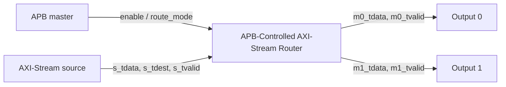
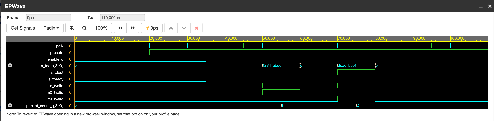
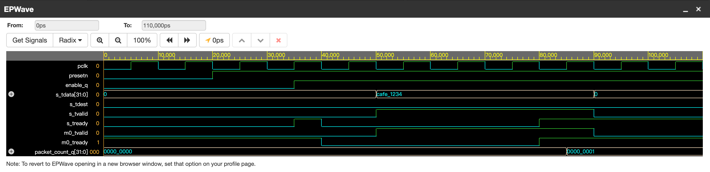
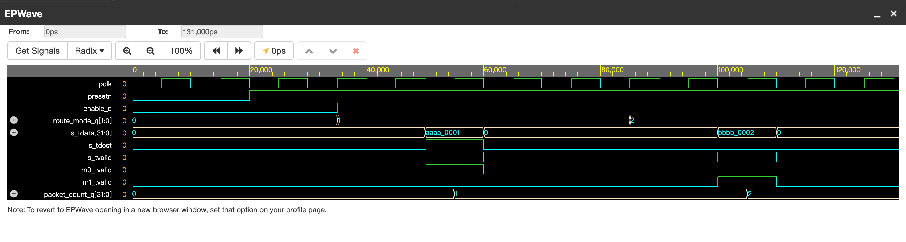
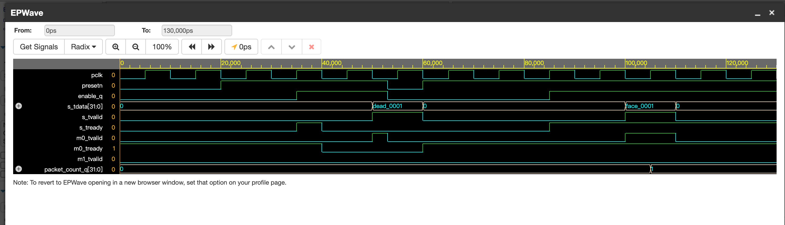
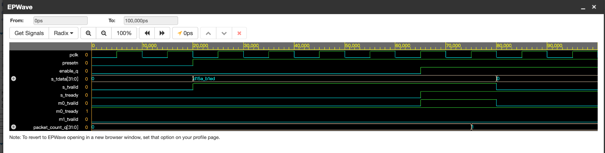
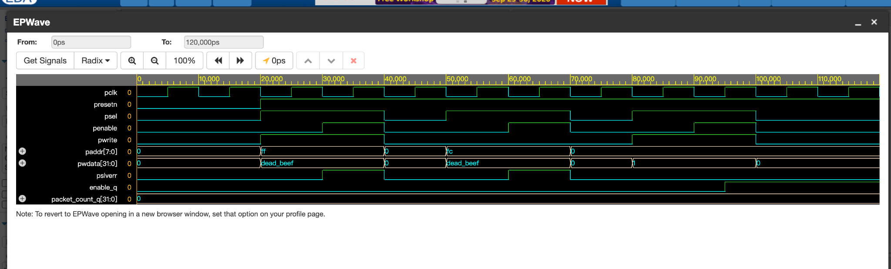
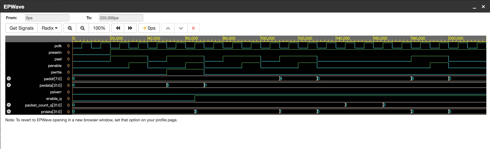

# APB-Controlled AXI-Stream Router Verification

A SystemVerilog verification project for a simplified APB-controlled AXI-Stream router.

## Overview

The DUT receives AXI-Stream packets from one input interface and routes them to one of two output interfaces.

APB is used as the control plane to configure the router. AXI-Stream is used as the data plane to transfer packets.



## DUT Features

* APB control register for `enable` and `route_mode`
* AXI-Stream input interface
* Two AXI-Stream output interfaces
* Default routing based on `s_tdest`
* Configurable force-route mode
* Backpressure propagation through the valid-ready handshake
* Packet counter
* Active-low asynchronous reset
* APB illegal-address error response through `pslverr`
* APB readback through `prdata`

## Register Map

| Address | Register | Access | Description                                |
| ------- | -------- | ------ | ------------------------------------------ |
| `0x00`  | `CTRL`   | RW     | `bit[0]`: enable; `bit[2:1]`: route mode   |
| `0x04`  | `STATUS` | RO     | Current enable status                      |
| `0x08`  | `COUNT`  | RO     | Number of successfully transferred packets |

### Route Modes

| `route_mode` | Behavior                            |
| ------------ | ----------------------------------- |
| `2'b00`      | Route packet according to `s_tdest` |
| `2'b01`      | Force all packets to output 0       |
| `2'b10`      | Force all packets to output 1       |
| `2'b11`      | Reserved; uses `s_tdest` routing    |

## Repository Structure

```text
rtl/
└── apb_axis_router.sv

tb/
├── router_smoke_tb.sv
├── router_backpressure_tb.sv
├── router_mode_tb.sv
├── router_reset_during_traffic_tb.sv
├── router_disabled_tb.sv
├── router_illegal_apb_tb.sv
└── router_apb_readback_tb.sv

docs/
└── images/
```

## Directed Test Results

| Testbench                           | Verification Scenario                                                                                    | Result |
| ----------------------------------- | -------------------------------------------------------------------------------------------------------- | ------ |
| `router_smoke_tb.sv`                | Enables the router through APB and verifies default `s_tdest` routing to output 0 and output 1           | PASS   |
| `router_backpressure_tb.sv`         | Blocks output 0 and verifies input backpressure, stable pending traffic, and correct counter behavior    | PASS   |
| `router_mode_tb.sv`                 | Verifies that APB-programmed `route_mode` overrides `s_tdest` and forces packets to output 0 or output 1 | PASS   |
| `router_reset_during_traffic_tb.sv` | Asserts reset while a packet is pending under backpressure and verifies correct post-reset recovery      | PASS   |
| `router_disabled_tb.sv`             | Verifies that a disabled router rejects valid input traffic until APB enable is asserted                 | PASS   |
| `router_illegal_apb_tb.sv`          | Verifies `pslverr` assertion for illegal APB read and write addresses                                    | PASS   |
| `router_apb_readback_tb.sv`         | Verifies APB readback of `CTRL`, `STATUS`, and `COUNT` through `prdata`                                  | PASS   |

## Waveform Evidence

<details>
<summary><b>1. Smoke Test - Default Routing</b></summary>

Verifies default packet routing based on `s_tdest` and packet counter updates.



</details>

<details>
<summary><b>2. Backpressure Test</b></summary>

Verifies that the router deasserts `s_tready` and does not count a packet while output 0 is not ready.



</details>

<details>
<summary><b>3. Route-Mode Control Test</b></summary>

Verifies that APB-programmed `route_mode_q` overrides `s_tdest` and forces packets to output 0 or output 1.



</details>

<details>
<summary><b>4. Reset During Traffic Test</b></summary>

Verifies that reset clears router state while a packet is pending and that the router recovers correctly after reconfiguration.



</details>

<details>
<summary><b>5. Disabled Router Test</b></summary>

Verifies that the router deasserts `s_tready`, suppresses output valid signals, and does not count traffic while `enable=0`.



</details>

<details>
<summary><b>6. Illegal APB Address Test</b></summary>

Verifies that `pslverr` is asserted only during the APB access phase for illegal read and write addresses, while legal accesses remain error-free.



</details>

<details>
<summary><b>7. APB Readback Test</b></summary>

Verifies that `prdata` correctly returns the reset and programmed values of `CTRL`, the current `STATUS`, and the final packet `COUNT`.



</details>

## Key Verification Findings

* AXI-Stream data transfers occur only when `tvalid && tready` is true.
* Backpressure propagates from a blocked output to the AXI-Stream input through `s_tready`.
* A packet remains uncounted until a valid-ready handshake completes.
* Reset immediately clears router state and prevents pending traffic from surviving reset.
* APB configuration controls the AXI-Stream data path through `enable` and `route_mode`.
* Illegal APB accesses are detected through `pslverr`.
* APB software-visible register values are verified through `prdata`.

## How to Run

1. Open [EDA Playground](https://www.edaplayground.com/).
2. Select **SystemVerilog** and **Icarus Verilog**.
3. Paste `rtl/apb_axis_router.sv` into the **Design** panel.
4. Paste one testbench from `tb/` into the **Testbench** panel.
5. Enable **Open EPWave after run**.
6. Click **Run**.

## Next Steps

* Add protocol assertions using SystemVerilog Assertions
* Add an end-to-end scoreboard
* Add functional coverage
* Add constrained-random traffic tests
* Build a regression test list and verification closure report
